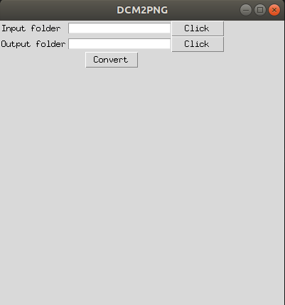

A simple app to convert dicom file to image (png).

## App python 

All of python code is in the **convert-app-mac.py** file. Here, we use **tkinter** to build the python app. 

## Quick tkinter turotial

### Make window

```python
gui = Tk()
gui.geometry("400x400")
gui.title("DCM2PNG")

```

### Make useful class to go and get path 

```
class FolderSelect(Frame):
    def __init__(self,parent=None,folderDescription="",**kw):
        Frame.__init__(self,master=parent,**kw)
        self.folderPath = StringVar()
        self.lblName = Label(self, text=folderDescription)
        self.lblName.grid(row=0,column=0)
        self.entPath = Entry(self, textvariable=self.folderPath)
        self.entPath.grid(row=0,column=1)
        self.btnFind = ttk.Button(self, text="Click",command=self.setFolderPath)
        self.btnFind.grid(row=0,column=2)
    def setFolderPath(self):
        folder_selected = filedialog.askdirectory()
        self.folderPath.set(folder_selected)
    @property
    def folder_path(self):
        return self.folderPath.get()
```

### Make app 

```
c = ttk.Button(gui, text="Convert", command = dcm2img)
c.grid(row=4,column=0)
gui.mainloop()
```

here **dcm2img** is the function to convert dicom file to png file and write error log file. 


## Run app in python 

```
$ python convert-app-mac.py
```

We then have the convert app 



We need chose the input directory and output directory, then **convert**
## Make .exe app 

To use .exe app, we need to install the package **pyinstaller**. All of dependencies is detailedin the **requirements.txt** file


##  Dependencies

It is important to install gdcm by conda. 

```
$ conda create --name spine python=3.7
$ conda activate spine
$ pip install -r requirements.txt
$ conda install -c conda-forge gdcm -y
```


To make Mac/Ubuntu app 
```
$ cd dicom2png-app
$ sudo pyinstaller convert-app-mac.py -n Converter --windowed --noconfirm --clean
```

To make Windows app 
```
$ cd dicom2png-app 
$ pyinstaller --onefile --name Converter convert-app-win.py
```
